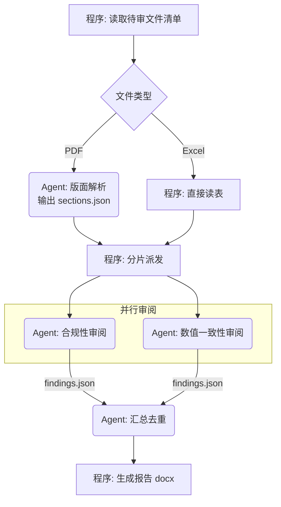

# 设计文档与用户核对模板

进入工作流步骤 3（用户核对）时使用。

目录：

- §一 结构化提问批次（**核对项的权威版本**）
- §二 设计文档骨架
- §三 mermaid 流程图写法
- §四 终审要点
- §五 增量设计文档骨架（仅增量入口）

## 一、结构化提问批次

本节是核对项的**权威版本**；SKILL.md §各场景必确认项 只补充各场景的差异项。

逐批向用户提问，**每批不超过 4 项**，优先使用宿主提供的结构化选项提问能力。按下列顺序，跳过与当前场景无关的批次。

### 批次 1 — 场景与边界（所有场景）

1. 场景分类结论是否认同？（给出你的判定 + 理由，并列出被排除的次优选项）
2. 本次范围的边界：明确**不做**什么
3. 输入的格式、形态、范围
4. 输出的格式、形态、交付方式

### 批次 2 — 能力边界（除「单 Agent Chat」外所有场景）

1. 工具 / MCP 清单（给出你建议的最小集合，请用户增删）
2. Skill 清单（如有）
3. 封装形态：bash/shell 是否可用（决定走 MCP/tools 还是 Skill）
4. 哪些步骤坚持用程序做、哪些交给 Agent

### 批次 2.5 — 启发式规则（仅当方案中出现用规则替代语义判断的地方）

1. 方案里有哪几处用关键词 / 正则 / 阈值替代了语义判断（逐条列出规则与它替代的判断）
2. 每条规则的**覆盖率论证**：用什么样本测的、命中率多少（低于 75% 不予引入）
3. 每条规则的**反例集**：它一定会判错的情形有哪些
4. 未覆盖部分的**兜底**：转 Agent 判断 / 转人工 / 显式报"无法判定"（不接受"按默认值处理"）

方案中没有启发式规则时，这一批跳过并在设计文档写明"无启发式规则"——这比不提更有价值，它说明你查过。

### 批次 3 — 授权与安全边界（所有场景；单 Agent Chat 无工具，只问第 3、4 项）

1. 每个工具/动作的**自主级别**（给出你的建议分档：`suggestion-only` / `assisted-action` / `controlled-automation` / `high-impact-automation`，请用户调整）
2. 高影响动作的**审批闸门**：谁审、在哪一步审、审不过怎么办；闸门放在哪段程序里
3. 哪些输入来源视为**不可信**（用户输入 / 网页 / 外部 API / 他人文件 / 工具返回夹带内容 / 子 Agent 产出）
4. 输出侧的**具名安全检查与判定码**，以及检查自身失败时的兜底行为

### 批次 4 — 资源上限（所有含 Agent 的场景）

1. LLM 型号与可用上下文窗口
2. 单次任务预估上下文占用，是否需要轮次限定或上下文压缩
3. LLM 并发上限
4. 单次任务的耗时/成本预算：上限是多少、超预算时降级还是拒绝（上规模场景另问单用户与全局预算、延迟目标按 p95 还是均值）

### 批次 5 — 工具返回体量（除「单 Agent Chat」外所有场景）

1. 哪些工具/MCP 的**最大返回**可能超 10k token（给出你的估算清单，请用户确认或补充实际数据规模）
2. 走哪条兜底路径：**loop 侧统一落盘**（能改 agent loop / harness 吗）还是**工具自身兜底**（分页 / 摘要 / 上限）
3. 落盘方案的落地位置：工作目录在哪、Agent 用哪些读取与检索工具取回、返回里保留哪些导航信息
4. 极端返回用例由谁建、最坏输入怎么造；实测仍超 10k 时是否接受改走落盘

### 批次 6 — 运行时边界与恢复（仅自建 agent loop / harness，或有副作用动作）

1. **终止条件**：怎么判定"做完了"——用什么外部可验证的条件，而不是模型自述
2. **四类上限**：步数 / 时间 / 成本 / 连续失败各是多少；撞上限后返回什么、能不能续跑
3. **错误处理**：哪些错误重试（退避参数）、哪些改了再试、哪些直接终止；无进展检测的阈值
4. **副作用与幂等**：哪些动作会改变外部状态、幂等键从哪来、部分失败怎么回滚或对账

用现成 harness 时这批仍要问前两项——默认值是多少、你的任务会不会撞上它。

### 批次 7 — 记忆与数据边界（仅有持久记忆、RAG 或跨会话状态）

1. **记什么**：哪些信息值得跨会话保留、写入判据是什么；哪些只是本次上下文
2. **谁读得到**：检索按什么过滤、过滤发生在哪一层（必须在内容进入模型上下文之前）、过滤条件从哪来
3. **存多久**：有效期、过期与冲突消解规则
4. **用户权利**：能否查看、更正、删除自己被记住的内容

### 批次 8 — 多 Agent 协作（仅含 2 个以上 Agent 的场景）

1. **必要性**：与单 Agent 基线相比，多出来的 Agent 换来了什么（新信息 / 真并行 / 上下文隔离 / 专用能力 / 独立控制），多花的成本与延迟是多少
2. 子 Agent 系统提示词：父 Agent 实时构建 / 固定单一 / 固定若干个按需分配；数量上限是多少、是否超过并发上限
3. **handoff 契约**：交接时带哪些字段（任务、验收标准、已确认事实、约束、未决问题、可用工具与权限、预算、产物引用、证据来源）
4. **冲突与信任**：并行任务的文件与职责范围如何互不相交、共享写入的并发控制方式；子 Agent 产出在父 Agent 采纳前是否筛查；评审型节点拿不拿得到原始证据

### 批次 9 — 提示词对齐（所有含 Agent 的场景）

1. 各 Agent 的系统提示词草案是否认可（角色设定、SOP 是否入提示词、摘取了哪些增益提示块）
2. 是否在提示词所在代码/文档中记录本次确认日期（供日后判断提示词是否过期）
3. 各 Agent 的模型与工具授权是否认可

### 批次 10 — 信息缺口确认（所有场景）

把 D1 扫描出的缺口列成清单，请用户逐条补充或确认可以留白。

这一批**不受"每批不超过 4 项"限制**：缺口是清单式确认而非决策式选择，一次性列全比分多轮更省沟通成本。缺口超过 10 条时按 Agent 分组呈现。

### 批次 11 — 注意力与分层（所有含 Agent 的场景）

1. 各 Agent 的信息分层方案：哪些进系统提示词、哪些下沉 Skill / 文件只留索引、哪些运行时传入
2. D2/D3/D4 中触线节点的处置（下沉 / 拆分 / 加路由 / 加检查点 / 返回落盘）是否认可——凡改变 Agent 数量或职责边界的，逐项确认
3. 长任务与长产物的承载方式：检查点位置、中间状态载体；产物模板由程序预建的分区表、各区归谁填、程序侧校验规则
4. （仅评审场景）现有实现的注意力问题清单，逐条确认**是否认同为问题**——未获认同的不提改进建议

### 批次 12 — 测试与评测（所有含 Agent 的场景）

1. 步骤级用例的覆盖范围：哪些节点必须有独立用例、每个节点的典型 / 边界 / 异常输入由谁提供
2. 非结构化产出的判定方式：是否建评测 Agent、rubric 条目与判分锚点由谁定、用于校准的人工标注样本从哪来
3. 是否建评测集：规模、样本来源（含回归样本与注入 / 越狱 / 有害输出切片）、由程序还是评测 Agent 批量执行
4. 门禁阈值：通过率下限、哪些标签不允许失败（安全标签默认不允许失败）、提示词/模型变更后是否强制重跑

### 批次 13 — 可观测与回放（所有场景）

1. **调试模式的开启方式**：配置 / 环境变量 / 请求头 / 管理接口哪一种；生产默认开还是关；谁有权开
2. **切片留什么**：哪些环节留完整输入输出（默认是全部环节，含程序段）、关闭态的骨架字段、存在哪、留存期多久
3. **回放怎么用**：能不能只跑一个环节、有副作用的环节回放走干跑还是沙箱、比对口径（精确值 / 结构与不变量）
4. **脱敏**：切片里哪些字段必须脱敏或不落盘；把切片固化成回归夹具时的脱敏责任人

判据见 `../runtime/observability.md`。这一批不跳过——单 Agent Chat 也要答，它只是环节少。

## 二、设计文档骨架

路径：目标项目 `docs/specs/YYYY-MM-DD-<short-desc>.md`；写完**必须**在 `docs/index.md` 增加一行索引。

`skillVersion` 填写本 skill 当前版本（SKILL.md frontmatter 的 `metadata.version`）。**读既有设计文档时按小节标题名定位，不要按编号**——章节编号会随模板版本变化，按编号对齐会写错位置。发现文档的 `skillVersion` 低于当前版本时，告知用户差异并询问是否按新模板补齐缺失小节。

```markdown
---
date: 'YYYY-MM-DD'
status: '待用户确认 | 已确认 | 已实现'
documentRole: 'spec'
sourceOfTruth: '../REQUIREMENTS.md'
skillVersion: '<填 SKILL.md frontmatter 的 metadata.version>'
---

# <功能名> — Agentic 方案设计

## 1. 意图与边界
产品/功能愿景（一句话）、用户是谁、成功标准、明确不做什么。

## 2. 场景分类结论
结论 + 判定理由 + 被排除的次优选项及排除原因。

## 3. 整体流程
（mermaid 流程图，见下方写法）

## 4. 角色与职责
| 节点 | 执行者 | 职责 | 输入 | 输出 |
|---|---|---|---|---|
| ... | 程序 / Agent-A | ... | ... | ... |

## 5. Agent 设计
每个 Agent 一小节：角色设定、系统提示词要点、纳入的增益提示块、工具/MCP/Skill 清单、SOP 是否入提示词、**信息分层与披露方式**（进提示词的 / 留索引按需加载的 / 运行时传入的）。

## 6. 信息传递链路
逐步骤说明：谁 → 谁、载体（文件/结构体/Prompt）、格式、字段含义。
长产物走模板+分区编辑时，另附分区表：

| 分区 | 内容与格式要求 | 填充者 | 依赖/顺序 | 校验规则（程序侧） |
|---|---|---|---|---|

## 7. 多 Agent 链路（仅含 2 个以上 Agent；否则写"单 Agent，本节 N/A"）
必要性论证（对照单 Agent 基线：换来了什么、多花了多少）、上下文共享方式与拓扑、拆分粒度与并发数。
另附 handoff 契约表：

| 从 → 到 | 传递内容（任务/验收标准/已确认事实/约束/未决问题/预算/产物引用/证据来源） | 载体 | 冲突与并发控制 | 采纳前的筛查 |
|---|---|---|---|---|

## 8. 上下文、注意力与并发预算
上下文窗口需求、压缩/轮次策略、并发上限、成本预估。
另附注意力负载表：

| Agent | 提示词字符数 | 首轮内嵌资料 | 工具数 | 并存场景数 | 触线项 | 处置 |
|---|---|---|---|---|---|---|

另附工具返回体量表（D4 产出）：

| 工具 / MCP | 最坏情况最大返回（估算 / 实测 token） | 是否触线（>10k） | 处置路径（loop 落盘 / 工具自兜底） | 兜底实现位置 | 极端返回用例 |
|---|---|---|---|---|---|

长任务的检查点位置与中间状态载体也写在本节。

## 9. 运行时契约与恢复（仅自建 loop 或含副作用动作；否则写 N/A 并说明用的是哪个 harness 及其默认上限）
终止条件（外部可验证的判据是什么）、撞上限后的返回形态、中断与恢复方式。

| 上限 | 值 | 撞上限后的行为 |
|---|---|---|
| 步数 | | |
| 时间 | | |
| 成本 | | |
| 连续失败 | | |

另附错误处理与幂等表：

| 动作 / 依赖 | 错误分类（可重试/可纠正/可降级/终止） | 重试与退避 | 幂等键来源 | 部分失败的回滚或对账 |
|---|---|---|---|---|

无进展检测的判据与阈值也写在本节。

## 10. 记忆与数据边界（仅有持久记忆、RAG 或跨会话状态；否则写"无状态，本节 N/A"）

| 状态类别（轨迹/运行时/用户记忆/业务状态/共享知识） | 存在哪 | 写入判据 | 保留期 | 可见范围与过滤方式 | 过滤发生的位置 |
|---|---|---|---|---|---|

用户的查看、更正、删除路径与冲突消解规则也写在本节。

## 11. 成本与性能预算（仅上规模或有明确预算/延迟约束；否则写 N/A）
计量口径（含 input 累积、缓存、重试、子 Agent 展开）、任务/用户/全局三级预算、超预算行为、延迟目标（p95/p99）、提示词的静态前缀与动态后缀划分。

## 12. 授权与安全边界
自主级别与审批闸门：

| Agent | 工具 / 动作 | 自主级别 | 审批闸门（谁审 / 哪一步 / 不通过怎么办） | 闸门实现位置 |
|---|---|---|---|---|

不可信输入清单：

| Agent | 不可信来源 | 传入方式（承载位置与标注） | 处理位置 |
|---|---|---|---|

输出侧安全检查：

| 判定码 | 检查什么 | 执行者与执行时机 | 触发时的处置 |
|---|---|---|---|

检查自身失败时的兜底行为（fail-closed 表现）也写在本节。自主级别的判档与闸门写法见 `../prompt/agent-construction.md` §三之二，信任分级与判定码见 `../safety/safety.md`。

## 13. 信息完备性确认
已确认充足的部分 / 缺口清单及处理方式。另附启发式规则清单（无则写"无启发式规则"）：

| 规则 | 替代了哪个判断 | 覆盖率与样本来源 | 反例集 | 未覆盖部分的兜底 | 用户确认日期 |
|---|---|---|---|---|---|

## 14. 与现有实现的差异（仅评审场景）
| 项 | 设计 | 现状 | 结论（保留现状 / 按设计改 / 待裁决） |
|---|---|---|---|

## 15. 测试与评测方案
步骤级用例覆盖范围、非结构化产出的判定方式与 rubric 归属、是否建评测集及其规模（含安全切片）、门禁阈值（通过率下限、不允许失败的标签）。写法见 `testing.md`。

## 16. 可观测与回放
调试模式的开关形态与默认值、关闭态骨架字段、切片存储与留存期、回放入口与副作用环节的处置。写法见 `../runtime/observability.md`。

| 环节 | 类型（程序/Agent/工具） | 切片字段（输入 / 输出 / 版本三元组） | 可否单环节回放 | 有副作用？回放处置 |
|---|---|---|---|---|

## 17. 确认记录
| 日期 | 确认人 | 确认范围 |
|---|---|---|
```

## 三、mermaid 流程图写法

要求：**用业务语言**写节点文字；用形状和分组区分执行者；标出并行与分支条件。

约定：

- 程序节点用矩形 `[...]`，Agent 节点用圆角 `(...)`，判断用菱形 `{...}`
- 每个 Agent 节点文字前缀 `Agent:`
- 并行分支在同一 subgraph 内并列
- 边上标注传递的**载体与内容**，而不只是"是/否"



## 四、终审要点

交给用户终审时，请用户逐组确认。每组末尾的**尤其确认**是该组最容易出事的一处：

- **结构**：流程图里每一步的执行者归属（程序 vs Agent）、分支条件是否穷尽、信息传递链路里有没有"这里 Agent 其实拿不到它需要的信息"。
- **负荷**：每个 Agent 首轮拿到的信息既不遗漏也不过载（该下沉的下沉了、该拆的拆了）；哪些工具的返回可能吃满上下文、兜底方式是否认可。**尤其确认**没有"估算超 10k 却没有任何兜底"的工具。
- **边界**：哪些动作允许 Agent 自己拍板、哪些必须过闸门；终止条件与四类上限；有副作用的动作重试是否安全、幂等键从哪来；有记忆或 RAG 时谁能读到谁的数据、过滤在哪一层；用规则替代语义判断处的覆盖率与兜底。**尤其确认**没有"不可逆动作被划成自动执行"、没有"会重复扣款却在自动重试"、过滤发生在内容进入模型上下文之前。
- **验证**：每个步骤打算怎么单独验证；调试模式怎么开、切片留哪些环节、能不能只回放一个环节。**尤其确认**没有哪一步只能靠整链跑通才知道对错，也没有"要观察就得先改代码上一次线"。

用户签字确认后，在文档的「确认记录」一节记录日期与确认范围，再进入实现。

若用户明确要求跳过核对：仍要写出文档，在「确认记录」一节记录"用户要求跳过核对"及**全部关键假设**，并一句话告知用户已按这些假设推进。

## 五、增量设计文档骨架（仅增量入口）

入口判定为「增量」时用这份精简骨架，不用 §二 的完整骨架。判定条件、退回信号与三步做法见 `../modes/incremental.md`。

路径与索引规则同 §二：`docs/specs/YYYY-MM-DD-<short-desc>.md`，写完必须更新 `docs/index.md`。

frontmatter 同 §二，另加一行 `baseline: '<平台基线文档路径或代码位置>'`。

```markdown
# <新增能力名> — 增量设计

## 1. 本次要加什么
一句话说明新增的 skill / 工具 / 服务，以及它解决什么问题。明确**不做**什么。

## 2. 继承声明
本次不重新论证的部分，逐项写明继承来源（**只写来源，不复述内容**）：

| 继承项 | 继承自（文档 / 代码位置） |
|---|---|
| 场景分类与编排模式 | |
| agent loop 与轮次上限 | |
| 并发上限与上下文上限 | |
| 既有工具清单与授权基线（含自主级别） | |
| 工具返回体量兜底机制（loop 侧落盘阈值 / 工具侧上限） | |
| 终止条件与四类上限（步数 / 时间 / 成本 / 连续失败） | |
| 调试模式与切片设施（开关形态、切片存储、回放入口） | |
| 错误分类、重试退避与幂等基线 | |
| 记忆与检索的隔离基线（过滤在哪一层、按什么过滤） | |
| 不可信输入清单与输出侧安全检查项 | |
| 既有测试与评测设施 | |

找不到继承来源的项，不写"沿用现有做法"，登记进第 5 节。

## 3. 增量设计
新增能力的职责、输入输出契约、隐式规则；接入既有流程的位置（哪个 Agent 在哪一步调用它）。

## 4. 增量的授权、预算与安全
| 项 | 增量值 |
|---|---|
| 自主级别 | |
| 审批闸门（仅高影响动作） | |
| 上下文占用增量 | |
| 并发占用增量 | |
| 新增工具的最坏情况最大返回与兜底方式（含极端返回用例） | |
| 新引入的不可信输入来源与处理位置 | |

## 5. 平台缺口清单
| 平台缺口 | 本次是否踩中 | 处置（补 / 登记为风险并标注影响 / 未踩中） |
|---|---|---|

## 6. 测试增量
新增节点的步骤级用例、新增的评测样本（含安全样本）、是否影响既有门禁阈值。

## 7. 确认记录
| 日期 | 确认人 | 确认范围 |
|---|---|---|
```
