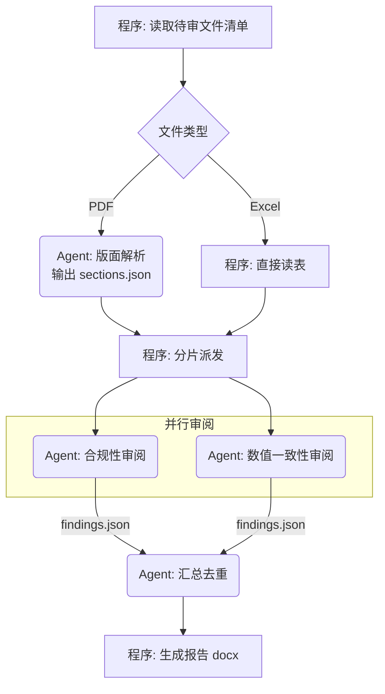

# 设计文档与用户核对模板

进入工作流步骤 3（用户核对）时使用。

目录：

- §一 结构化提问批次（**核对项的权威版本**）
- §二 设计文档骨架
- §三 mermaid 流程图写法
- §四 终审要点
- §五 增量设计文档骨架（仅增量入口）

## 一、结构化提问批次

本节是核对项的**权威版本**；SKILL.md §各场景必确认项 只补充各场景的差异项。

逐批向用户提问，**每批不超过 4 项**，优先使用宿主提供的结构化选项提问能力。按下列顺序，跳过与当前场景无关的批次。

### 批次 1 — 场景与边界（所有场景）

1. 场景分类结论是否认同？（给出你的判定 + 理由，并列出被排除的次优选项）
2. 本次范围的边界：明确**不做**什么
3. 输入的格式、形态、范围
4. 输出的格式、形态、交付方式

### 批次 2 — 能力边界（除「单 Agent Chat」外所有场景）

1. 工具 / MCP 清单（给出你建议的最小集合，请用户增删）
2. Skill 清单（如有）
3. 封装形态：bash/shell 是否可用（决定走 MCP/tools 还是 Skill）
4. 哪些步骤坚持用程序做、哪些交给 Agent

### 批次 3 — 授权与安全边界（所有场景；单 Agent Chat 无工具，只问第 3、4 项）

1. 每个工具/动作的**自主级别**（给出你的建议分档：`suggestion-only` / `assisted-action` / `controlled-automation` / `high-impact-automation`，请用户调整）
2. 高影响动作的**审批闸门**：谁审、在哪一步审、审不过怎么办；闸门放在哪段程序里
3. 哪些输入来源视为**不可信**（用户输入 / 网页 / 外部 API / 他人文件 / 工具返回夹带内容 / 子 Agent 产出）
4. 输出侧的**具名安全检查与判定码**，以及检查自身失败时的兜底行为

### 批次 4 — 资源上限（所有含 Agent 的场景）

1. LLM 型号与可用上下文窗口
2. 单次任务预估上下文占用，是否需要轮次限定或上下文压缩
3. LLM 并发上限
4. 单次任务的耗时/成本预算

### 批次 5 — 多 Agent 协作（仅父子 Agentic / Agentic 工作流）

1. 子 Agent 系统提示词：父 Agent 实时构建 / 固定单一 / 固定若干个按需分配
2. 子 Agent 数量上限，是否超过并发上限
3. 程序与 Agent 之间的信息传递方式（文件 / 结构体 / Prompt）
4. 并行任务的冲突边界（各子 Agent 的文件与职责范围如何互不相交）；子 Agent 产出在父 Agent 采纳前是否筛查

### 批次 6 — 提示词对齐（所有含 Agent 的场景）

1. 各 Agent 的系统提示词草案是否认可（角色设定、SOP 是否入提示词、摘取了哪些增益提示块）
2. 是否在提示词所在代码/文档中记录本次确认日期（供日后判断提示词是否过期）
3. 各 Agent 的模型与工具授权是否认可

### 批次 7 — 信息缺口确认（所有场景）

把步骤 2.5 扫描出的缺口列成清单，请用户逐条补充或确认可以留白。

这一批**不受"每批不超过 4 项"限制**：缺口是清单式确认而非决策式选择，一次性列全比分多轮更省沟通成本。缺口超过 10 条时按 Agent 分组呈现。

### 批次 8 — 注意力与分层（所有含 Agent 的场景）

1. 各 Agent 的信息分层方案：哪些进系统提示词、哪些下沉 Skill / 文件只留索引、哪些运行时传入
2. 步骤 2.6a/2.6b 中触线节点的处置（下沉 / 拆分 / 加路由 / 加检查点）是否认可——凡改变 Agent 数量或职责边界的，逐项确认
3. 长任务与长产物的承载方式：检查点位置、中间状态载体；产物模板由程序预建的分区表、各区归谁填、程序侧校验规则
4. （仅评审场景）现有实现的注意力问题清单，逐条确认**是否认同为问题**——未获认同的不提改进建议

### 批次 9 — 测试与评测（所有含 Agent 的场景）

1. 步骤级用例的覆盖范围：哪些节点必须有独立用例、每个节点的典型 / 边界 / 异常输入由谁提供
2. 非结构化产出的判定方式：是否建评测 Agent、rubric 条目与判分锚点由谁定、用于校准的人工标注样本从哪来
3. 是否建评测集：规模、样本来源（含回归样本与注入 / 越狱 / 有害输出切片）、由程序还是评测 Agent 批量执行
4. 门禁阈值：通过率下限、哪些标签不允许失败（安全标签默认不允许失败）、提示词/模型变更后是否强制重跑

## 二、设计文档骨架

路径：目标项目 `docs/specs/YYYY-MM-DD-<short-desc>.md`；写完**必须**在 `docs/index.md` 增加一行索引。

`skillVersion` 填写本 skill 当前版本（SKILL.md frontmatter 的 `metadata.version`）。**读既有设计文档时按小节标题名定位，不要按编号**——章节编号会随模板版本变化，按编号对齐会写错位置。发现文档的 `skillVersion` 低于当前版本时，告知用户差异并询问是否按新模板补齐缺失小节。

```markdown
---
date: 'YYYY-MM-DD'
status: '待用户确认 | 已确认 | 已实现'
documentRole: 'spec'
sourceOfTruth: '../REQUIREMENTS.md'
skillVersion: '0.4.0'
---

# <功能名> — Agentic 方案设计

## 1. 意图与边界
产品/功能愿景（一句话）、用户是谁、成功标准、明确不做什么。

## 2. 场景分类结论
结论 + 判定理由 + 被排除的次优选项及排除原因。

## 3. 整体流程
（mermaid 流程图，见下方写法）

## 4. 角色与职责
| 节点 | 执行者 | 职责 | 输入 | 输出 |
|---|---|---|---|---|
| ... | 程序 / Agent-A | ... | ... | ... |

## 5. Agent 设计
每个 Agent 一小节：角色设定、系统提示词要点、纳入的增益提示块、工具/MCP/Skill 清单、SOP 是否入提示词、**信息分层与披露方式**（进提示词的 / 留索引按需加载的 / 运行时传入的）。

## 6. 信息传递链路
逐步骤说明：谁 → 谁、载体（文件/结构体/Prompt）、格式、字段含义。
长产物走模板+分区编辑时，另附分区表：

| 分区 | 内容与格式要求 | 填充者 | 依赖/顺序 | 校验规则（程序侧） |
|---|---|---|---|---|

## 7. 上下文、注意力与并发预算
上下文窗口需求、压缩/轮次策略、并发上限、成本预估。
另附注意力负载表：

| Agent | 提示词字符数 | 首轮内嵌资料 | 工具数 | 并存场景数 | 触线项 | 处置 |
|---|---|---|---|---|---|---|

长任务的检查点位置与中间状态载体也写在本节。

## 8. 授权与安全边界
自主级别与审批闸门：

| Agent | 工具 / 动作 | 自主级别 | 审批闸门（谁审 / 哪一步 / 不通过怎么办） | 闸门实现位置 |
|---|---|---|---|---|

不可信输入清单：

| Agent | 不可信来源 | 传入方式（承载位置与标注） | 处理位置 |
|---|---|---|---|

输出侧安全检查：

| 判定码 | 检查什么 | 执行者与执行时机 | 触发时的处置 |
|---|---|---|---|

检查自身失败时的兜底行为（fail-closed 表现）也写在本节。自主级别的判档与闸门写法见 `agent-construction.md` §三之二，信任分级与判定码见 `safety.md`。

## 9. 信息完备性确认
已确认充足的部分 / 缺口清单及处理方式。

## 10. 与现有实现的差异（仅评审场景）
| 项 | 设计 | 现状 | 结论（保留现状 / 按设计改 / 待裁决） |
|---|---|---|---|

## 11. 测试与评测方案
步骤级用例覆盖范围、非结构化产出的判定方式与 rubric 归属、是否建评测集及其规模（含安全切片）、门禁阈值（通过率下限、不允许失败的标签）。写法见 `testing.md`。

## 12. 确认记录
| 日期 | 确认人 | 确认范围 |
|---|---|---|
```

## 三、mermaid 流程图写法

要求：**用业务语言**写节点文字；用形状和分组区分执行者；标出并行与分支条件。

约定：

- 程序节点用矩形 `[...]`，Agent 节点用圆角 `(...)`，判断用菱形 `{...}`
- 每个 Agent 节点文字前缀 `Agent:`
- 并行分支在同一 subgraph 内并列
- 边上标注传递的**载体与内容**，而不只是"是/否"



## 四、终审要点

交给用户终审时，明确请用户确认这几件事：

1. 流程图里每一步的**执行者归属**（程序 vs Agent）是否认同
2. 分支条件是否穷尽
3. 信息传递链路里有没有"这里 Agent 其实拿不到它需要的信息"
4. 每个 Agent 首轮拿到的信息是否**既不遗漏也不过载**——该下沉的下沉了，该拆的拆了
5. 哪些动作允许 Agent 自己拍板、哪些必须过闸门——尤其确认没有"不可逆动作被划成自动执行"
6. 每个步骤打算怎么单独验证——有没有哪一步只能靠整链跑通来判断对错
7. 上限与预算是否可接受

用户签字确认后，在文档的「确认记录」一节记录日期与确认范围，再进入实现。

若用户明确要求跳过核对：仍要写出文档，在「确认记录」一节记录"用户要求跳过核对"及**全部关键假设**，并一句话告知用户已按这些假设推进。

## 五、增量设计文档骨架（仅增量入口）

入口判定为「增量」时用这份精简骨架，不用 §二 的完整骨架。判定条件、退回信号与三步做法见 `incremental.md`。

路径与索引规则同 §二：`docs/specs/YYYY-MM-DD-<short-desc>.md`，写完必须更新 `docs/index.md`。

```markdown
---
date: 'YYYY-MM-DD'
status: '待用户确认 | 已确认 | 已实现'
documentRole: 'spec'
sourceOfTruth: '../REQUIREMENTS.md'
skillVersion: '0.4.0'
baseline: '<平台基线文档路径或代码位置>'
---

# <新增能力名> — 增量设计

## 1. 本次要加什么
一句话说明新增的 skill / 工具 / 服务，以及它解决什么问题。明确**不做**什么。

## 2. 继承声明
本次不重新论证的部分，逐项写明继承来源（**只写来源，不复述内容**）：

| 继承项 | 继承自（文档 / 代码位置） |
|---|---|
| 场景分类与编排模式 | |
| agent loop 与轮次上限 | |
| 并发上限与上下文上限 | |
| 既有工具清单与授权基线（含自主级别） | |
| 不可信输入清单与输出侧安全检查项 | |
| 既有测试与评测设施 | |

找不到继承来源的项，不写"沿用现有做法"，登记进第 5 节。

## 3. 增量设计
新增能力的职责、输入输出契约、隐式规则；接入既有流程的位置（哪个 Agent 在哪一步调用它）。

## 4. 增量的授权、预算与安全
| 项 | 增量值 |
|---|---|
| 自主级别 | |
| 审批闸门（仅高影响动作） | |
| 上下文占用增量 | |
| 并发占用增量 | |
| 新引入的不可信输入来源与处理位置 | |

## 5. 平台缺口清单
| 平台缺口 | 本次是否踩中 | 处置（补 / 登记为风险并标注影响 / 未踩中） |
|---|---|---|

## 6. 测试增量
新增节点的步骤级用例、新增的评测样本（含安全样本）、是否影响既有门禁阈值。

## 7. 确认记录
| 日期 | 确认人 | 确认范围 |
|---|---|---|
```
