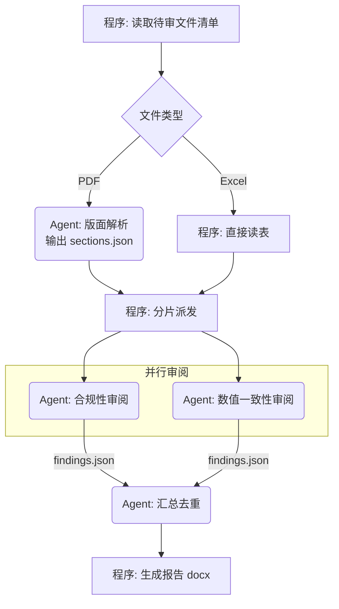

# 设计文档与用户核对模板

进入工作流步骤 3（用户核对）时使用。

目录：

- §一 结构化提问批次（**核对项的权威版本**）
- §二 设计文档骨架
- §三 mermaid 流程图写法
- §四 终审要点

## 一、结构化提问批次

本节是核对项的**权威版本**；SKILL.md §各场景必确认项 只补充各场景的差异项。

逐批向用户提问，**每批不超过 4 项**，优先使用宿主提供的结构化选项提问能力。按下列顺序，跳过与当前场景无关的批次。

### 批次 1 — 场景与边界（所有场景）

1. 场景分类结论是否认同？（给出你的判定 + 理由，并列出被排除的次优选项）
2. 本次范围的边界：明确**不做**什么
3. 输入的格式、形态、范围
4. 输出的格式、形态、交付方式

### 批次 2 — 能力边界（除「单 Agent Chat」外所有场景）

1. 工具 / MCP 清单（给出你建议的最小集合，请用户增删）
2. Skill 清单（如有）
3. 封装形态：bash/shell 是否可用（决定走 MCP/tools 还是 Skill）
4. 哪些步骤坚持用程序做、哪些交给 Agent

### 批次 3 — 资源上限（所有含 Agent 的场景）

1. LLM 型号与可用上下文窗口
2. 单次任务预估上下文占用，是否需要轮次限定或上下文压缩
3. LLM 并发上限
4. 单次任务的耗时/成本预算

### 批次 4 — 多 Agent 协作（仅父子 Agentic / Agentic 工作流）

1. 子 Agent 系统提示词：父 Agent 实时构建 / 固定单一 / 固定若干个按需分配
2. 子 Agent 数量上限，是否超过并发上限
3. 程序与 Agent 之间的信息传递方式（文件 / 结构体 / Prompt）
4. 并行任务的冲突边界（各子 Agent 的文件与职责范围如何互不相交）

### 批次 5 — 提示词对齐（所有含 Agent 的场景）

1. 各 Agent 的系统提示词草案是否认可（角色设定、SOP 是否入提示词、摘取了哪些增益块）
2. 是否在提示词所在代码/文档中记录本次确认日期（供日后判断提示词是否过期）
3. 各 Agent 的模型与工具授权是否认可

### 批次 6 — 信息缺口确认（所有场景）

把步骤 2.5 扫描出的缺口列成清单，请用户逐条补充或确认可以留白。

这一批**不受"每批不超过 4 项"限制**：缺口是清单式确认而非决策式选择，一次性列全比分多轮更省沟通成本。缺口超过 10 条时按 Agent 分组呈现。

## 二、设计文档骨架

路径：目标项目 `docs/specs/YYYY-MM-DD-<short-desc>.md`；写完**必须**在 `docs/index.md` 增加一行索引。

```markdown
---
date: 'YYYY-MM-DD'
status: '待用户确认 | 已确认 | 已实现'
documentRole: 'spec'
sourceOfTruth: '../REQUIREMENTS.md'
---

# <功能名> — Agentic 方案设计

## 1. 意图与边界
产品/功能愿景（一句话）、用户是谁、成功标准、明确不做什么。

## 2. 场景分类结论
结论 + 判定理由 + 被排除的次优选项及排除原因。

## 3. 整体流程
（mermaid 流程图，见下方写法）

## 4. 角色与职责
| 节点 | 执行者 | 职责 | 输入 | 输出 |
|---|---|---|---|---|
| ... | 程序 / Agent-A | ... | ... | ... |

## 5. Agent 设计
每个 Agent 一小节：角色设定、系统提示词要点、纳入的增益提示块、工具/MCP/Skill 清单、SOP 是否入提示词。

## 6. 信息传递链路
逐步骤说明：谁 → 谁、载体（文件/结构体/Prompt）、格式、字段含义。

## 7. 上下文与并发预算
上下文窗口需求、压缩/轮次策略、并发上限、成本预估。

## 8. 信息完备性确认
已确认充足的部分 / 缺口清单及处理方式。

## 9. 与现有实现的差异（仅评审场景）
| 项 | 设计 | 现状 | 结论（保留现状 / 按设计改 / 待裁决） |

## 10. 确认记录
| 日期 | 确认人 | 确认范围 |
```

## 三、mermaid 流程图写法

要求：**用业务语言**写节点文字；用形状和分组区分执行者；标出并行与分支条件。

约定：

- 程序节点用矩形 `[...]`，Agent 节点用圆角 `(...)`，判断用菱形 `{...}`
- 每个 Agent 节点文字前缀 `Agent:`
- 并行分支在同一 subgraph 内并列
- 边上标注传递的**载体与内容**，而不只是"是/否"



## 四、终审要点

交给用户终审时，明确请用户确认这几件事：

1. 流程图里每一步的**执行者归属**（程序 vs Agent）是否认同
2. 分支条件是否穷尽
3. 信息传递链路里有没有"这里 Agent 其实拿不到它需要的信息"
4. 上限与预算是否可接受

用户签字确认后，在文档 §10 记录日期与确认范围，再进入实现。

若用户明确要求跳过核对：仍要写出文档，在 §10 记录"用户要求跳过核对"及**全部关键假设**，并一句话告知用户已按这些假设推进。
